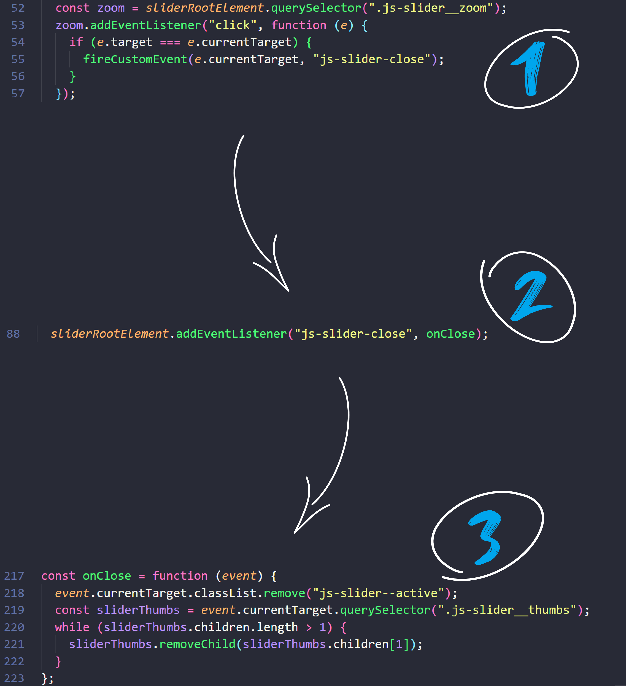
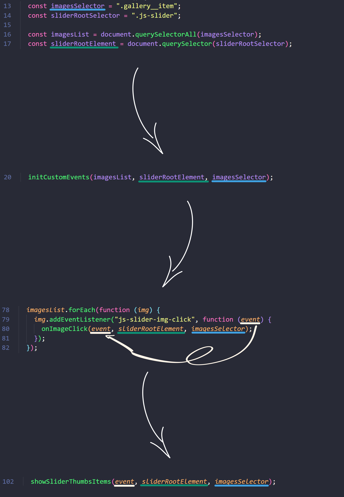

# Image gallery in JS

It's the conclusion of **6th chapter** (there's **20**) of [devmentor.pl](https://devmentor.pl/mentoring-javascript) mentoring program.

In this project I was asked to write new functionalities in JS:

[1) click on an image to zoom in.](./README-assets/zoom-in.gif) //TUTAJ SKOŃCZYŁEM. Sprawdź czy link przekierowuje!
2) show pictures from the same group below the clicked img.
3) click on arrows to swipe pictures left/right.
4) click on background to return to the gallery.
5) if client swipes to the end of an img group start from the beginning/end.
6) swipe pictures automatically just after click on desired img.

There were certain conditions I needed to make:
- HTML, CSS and some JS are ready. I should not change them.
- Stick to already written convention.

Here you can check pre-written JS | Here you can check my code!

To write these functionalities I had to work with custom events that had predetermined task:

`js-slider-img-click` - an event that is triggered when clicking on the image on the page (this is already done in the script.js file) and should display our slideshow

`js-slider-img-next` - an event triggered by clicking the right arrow on the page and should show the next image (if it exists) among those visible in the thumbnails

`js-slider-img-prev` - similar to above, but for the left arrow

`js-slider-close` - an event triggered by clicking in the empty space around the displayed photo, i.e., in the .js-slider__zoom element (and only this element! Be careful with event propagation).

---

## Content:
##### [1) Challenges:](#1-challenges)

[1. Event.target in custom events.](#eventtarget-in-custom-events)
[2. Stop automatic image swipe - clearInterval().](#stop-automatic-image-swipe---clearinterval)
[3. Write things down.](#write-things-down)

##### [2) Gained knowledge](#gained-knowledge)

---

### Event.target in custom events

In this project I was constantly using custom events to get comfortable with them. Combining the events with regular events can lead to some confusion on what event.target actually is. In the project custom events where handled like this:



**:one:** clicking on the zoom element creates new event and dispatch it in `fireCustomEvent(element, name); `
- `element:` is the place where the event has been dispatched.
- `name:` is the name of the new event.

**:two:** evokes onClose() as soon as specific element has been clicked to launch `js-slider-close` custom event.

**:three:** the function executes.

While writing `onClose()` I noticed that `event.target` is not the element on which I was clicking (zoom) but the argument - `element` in `fireCustomEvent(element, name)`. If I'd change `element = e.currentTarget` to `element = sliderRootElement`, then in `onClose()` **`event.currentTarget === event.target === this`**. It's easy to mistake the actual value of `event.target` because of `click` event that triggers another event.

---

### Stop automatic image swipe - clearInterval()

5) Problems with stoping setInterval(); :

Miałem za zadanie napisać kod, który będzie przełączał obrazki co określony czas.

Zaczynałem od funkcji:

```
const imageNextTimeline = function (e) {
  setInterval(() => {
    fireCustomEvent(this, "js-slider-img-next");
  }, 5000;
}
```

- It was responsible for every 5s call of the function which was swiping images.

To stop `setInterval()` I needed to create a variable because `setInterval()` returns it's id and then enables to use clearInterval() to stop it.

```
const imageNextTimeline = function (e) {
  setInterval(() => {
    fireCustomEvent(this, "js-slider-img-next");
  }, 5000;
}
```

but stopping setInterval() wasn't that easy. I was thinking how to do it and started playing with some conditionals like:

```
const imageNextTimeline = function (e) {
  if (this.getAttribute("class").includes("js-slider--active")) {
    const timer = setInterval(() => {
      fireCustomEvent(this, "js-slider-img-next");
    }, 5000);
  } else {
    clearInterval(timer);
  }
};
```

but because of creating variable in different code blocks i couldn't access the timer.
I tried different approach in which I'd use function undefined parameter `timer` so it's created outside of conditionals. But the function was destroing the parameter as soon as function was done. But the idea that the variable needs to be outside of conditionals was closer to the solution:

```
const imageNextTimeline = function (e, timer) {
  if (this.getAttribute("class").includes("js-slider--active")) {
    timer = setInterval(() => {
      fireCustomEvent(this, "js-slider-img-next");
    }, 5000);
  } else {
    clearInterval(timer);
  }
};
```

I learned that I need to define global variable and then use these conditionals. I really didn't want to define it globally tho, because it's a bad practice, you can mess a lot of things with it. I've decided to create object and in the object define a variable which is acessible by functions responsible for starting and stoping the swiping. It looked like this:

```
const slideStartStop = {
  intervalId: "",
  startSlide: function () {
    slideStartStop.intervalId = setInterval(() => {
      fireCustomEvent(this, "js-slider-img-next");
    }, 5000);
  },
  stopSlide: function () {
    clearInterval(slideStartStop.intervalId);
  },
};
```

---

### Write things down
Writing down informations about elements within a project using comments helps to find the way around the code. Let's delve into examples.

Function nesting is a common practice. Arguments are passed through multiple functions, making it easy to lose track of each argument's value. Consider the following example from this project, which illustrates the path arguments must take to reach the `showSliderThumbsItems()`



It's a long way. Consistently naming parameters that accept the same inputs helps not to get lost. Additionally, I frequently insert comments within the function I'm currently working on:

```
// event - img's event object
// sliderRootElement = ".js-slider";
// imagesSelector = ".gallery__item";
```
at the end of the project I delete it so it won't create any confusion. It's only for me.

I also use comments to organize my efforts and break down problems into more manageable chunks, for example:

I had to create a function named `onImageClick()`.

I write down:
- What client sees:
`// click on img calls the function which shows clicked image enlarged.`

- What operations does the function do on specific elements:
`// takes src from clicked img and pastes it inside img with class js-slider__caption.`

- How can I divide each functionality inside the function:
`// onImageClick() will have two functions one for showing clicked img, second for showing images in thumbnails.`
- What other elements concerns the function:
`// initCustomEvents() calls the function. I'll need to add eventListener there. I need to use fireCustomEvent() to create "js-slider-img-click" event.`

etc.

Again, It's only for me. I don't leave it in the final project. It helps to gather my thoughts.

---

### Gained knowledge:
:white_check_mark: Get around pre-written code.<br>
:white_check_mark: Working with custom events.<br>
:white_check_mark: Comprehension of `Event object`.<br>
:white_check_mark: Usage of `setInterval()`.<br>
:white_check_mark: Improve readability of functions - decomposition.<br>
:white_check_mark: Keep code [DRY](https://en.wikipedia.org/wiki/Don%27t_repeat_yourself).