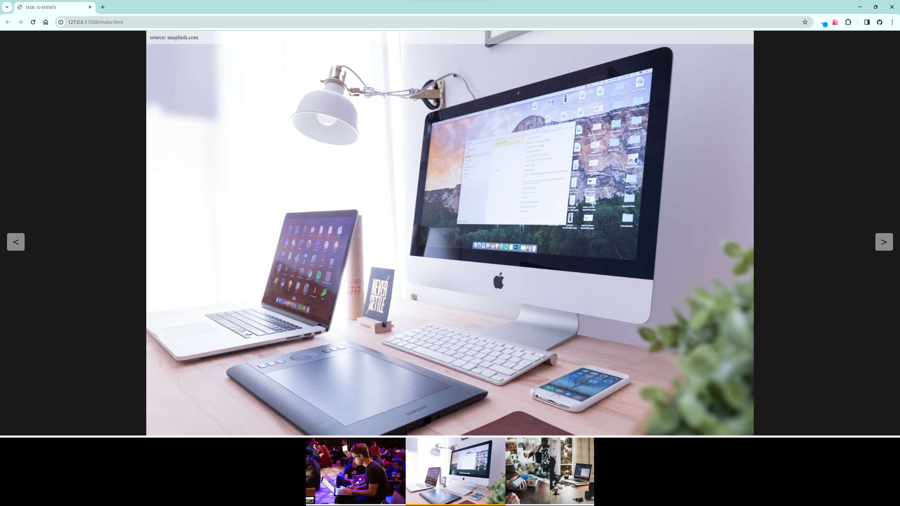

# Image gallery in JS

It's the conclusion of **6th chapter** (there's **20**) of [devmentor.pl](https://devmentor.pl/mentoring-javascript) mentoring program.

In this project I was asked to write new functionalities in JS:

[1) Click on an image to zoom in.](./README-assets/intro-zoom-in.gif)<br>
[2) Show pictures from the same group below the picked img.](./README-assets/intro-pictures-group.png)<br>
[3) Click on arrows to swipe pictures left/right.](./README-assets/intro-left-right-swipe.gif)<br>
[4) Click on background to return to the gallery.](./README-assets/intro-zoom-out.gif)<br>
[5) If the client swipes to the end of an image group, loop back to the beginning/end.](./README-assets/intro-from-the-start.gif)<br>
[6) After clicking on a desired image, the automatic image swiping feature activates.](./README-assets/intro-auto-swipe.gif)

There were certain conditions I needed to make:
- HTML, CSS and part of JS are ready. I should not change them.
- Stick to the already written convention.

[Here you can check pre-written JS](./README-assets/pre-written%20code/assets/js/script.js) | [Here you can check my code!](./assets/js/script.js)

To implement the functionalities, I had to work with custom events with predefined tasks:

`js-slider-img-click` - an event that is triggered when clicking on the image on the page (this is already done in the script.js file) and should display our slideshow.

`js-slider-img-next` - an event triggered by clicking the right arrow on the page and should show the next image (if it exists) among those visible in the thumbnails.

`js-slider-img-prev` - similar to above, but for the left arrow.

`js-slider-close` - an event triggered by clicking in the empty space around the displayed photo, i.e., in the .js-slider__zoom element (and only this element! Be careful with event propagation).

---

## Content:
##### [1) Challenges:](#1-challenges)

[1. Event.target in custom events.](#eventtarget-in-custom-events)<br>
[2. Stop automatic image swipe - clearInterval().](#stop-automatic-image-swipe---clearinterval)<br>
[3. Write things down.](#write-things-down)

##### [2) Gained knowledge](#gained-knowledge)

---

### Event.target in custom events

In this project I was constantly using **custom events** to get comfortable with them. Combining the events with regular events can lead to some confusion on what `event.target` actually is. In the project custom events where handled like this:


**:one:** clicking on the zoom element creates new event and dispatch it with `fireCustomEvent(element, name); `
- `element:` is the place where the event has been dispatched.
- `name:` is the name of the new event.

**:two:** evokes `onClose()` as soon as specific element has been clicked to launch `js-slider-close` custom event.

**:three:** the function executes.

While writing `onClose()`:

- I thought that `event.target` is the element on which I clicked like in **:one:**.
It was because in `fireCustomEvent(element, name)` the `element = e.currentTarget` which was the same as `e.target` of the 'click' event.
- In `fireCustomEvent(element, name)`, if I'd change the "element" for `sliderRootElement`, then in the `onClose()` `event.target`, `event.currentTarget`, and `this` would all refer to the `sliderRootElement`.
- `Event.target` represents the element on which the event was triggered.

---

### Stop automatic image swipe - clearInterval()

I had to implement code that automatically swipes images at regular intervals.

I've started with a function:

```
const imageNextTimeline = function (e) {
  setInterval(() => {
    fireCustomEvent(this, "js-slider-img-next");
  }, 5000;
}
```

*It triggers the event which calls the function that swipes images every 5 seconds.*

To stop `setInterval()`, I needed to create a variable to store its ID, which I could then use with `clearInterval()` to stop the interval.
I was trying to utilize the variable in different ways like playing with some conditionals:

```
const imageNextTimeline = function (e) {
  if (this.getAttribute("class").includes("js-slider--active")) {
    const timer = setInterval(() => {
      fireCustomEvent(this, "js-slider-img-next");
    }, 5000);
  } else {
    clearInterval(timer);
  }
};
```
Due to the creation of the variable in first code block, it was impossible to access the `timer` in the second one. I experimented with a different approach, attempting to use an undefined parameter `timer` so that it would be created outside of conditionals:
```
const imageNextTimeline = function (e, timer) {
  if (this.getAttribute("class").includes("js-slider--active")) {
    timer = setInterval(() => {
      fireCustomEvent(this, "js-slider-img-next");
    }, 5000);
  } else {
    clearInterval(timer);
  }
};
```
However, the parameter was being destroyed as soon as the function finished executing. Nonetheless, the concept that the variable needed to exist outside of conditionals brought me closer to the solution.

 I learned that I needed to define a global variable and then use it within those conditionals. I really didn't want to define it globally, though, because it's considered bad practice and it can lead to many issues. Instead, I decided to create an object and define a variable within it that is accessible by functions responsible for starting and stopping the swiping:

```
const slideStartStop = {
  intervalId: "",
  startSlide: function () {
    slideStartStop.intervalId = setInterval(() => {
      fireCustomEvent(this, "js-slider-img-next");
    }, 5000);
  },
  stopSlide: function () {
    clearInterval(slideStartStop.intervalId);
  },
};
```
Now auto swiping can be turn on/off with just a right click.

---

### Write things down
Writing down informations about elements within a project using comments helps to find the way around the code. Let's delve into examples.

Function nesting is a common practice. Arguments are passed through multiple functions, making it easy to lose track of each argument's value. Consider the following example from this project, which illustrates the path arguments must take to reach the `showSliderThumbsItems()`


It's a long way. Consistently naming parameters that accept the same inputs helps not to get lost. Additionally, I frequently insert comments within the function I'm currently working on:

```
// event - img's event object
// sliderRootElement = ".js-slider";
// imagesSelector = ".gallery__item";
```
At the end of the project I delete it so it won't create any confusion. It's only for me.

I also use comments to organize my efforts and break down problems into more manageable chunks, for example:

I had to create a function named `onImageClick()`.

I write down:
- What client sees:
`// click on img calls the function which shows clicked image enlarged.`

- What operations does the function do on specific elements:
`// takes src from clicked img and pastes it inside img with class js-slider__caption.`

- How can I divide each functionality inside the function:
`// onImageClick() will have two functions one for showing clicked img, second for showing images in thumbnails.`
- What other elements concerns the function:
`// initCustomEvents() calls the function. I'll need to add eventListener there. I need to use fireCustomEvent() to create "js-slider-img-click" event.`

etc.

Again, It's only for me. I don't leave it in the final project. It helps to gather my thoughts.

---

### Gained knowledge:
:white_check_mark: Get around pre-written code.<br>
:white_check_mark: Working with custom events.<br>
:white_check_mark: Comprehension of `Event object`.<br>
:white_check_mark: Usage of `setInterval()`.<br>
:white_check_mark: Improve readability of functions - decomposition.<br>
:white_check_mark: Keep the code [DRY](https://en.wikipedia.org/wiki/Don%27t_repeat_yourself).
